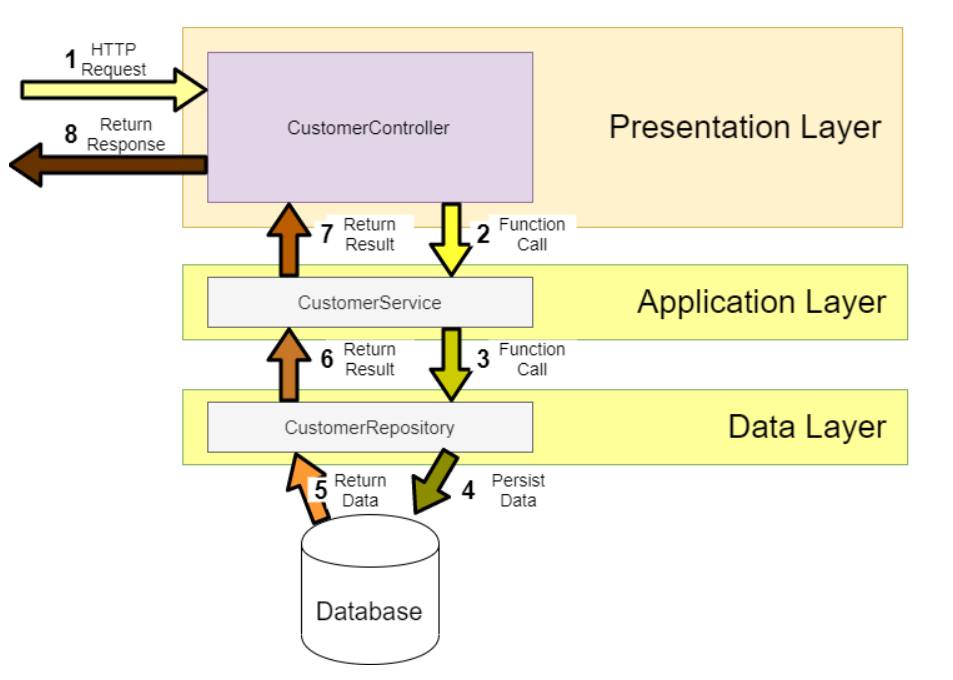
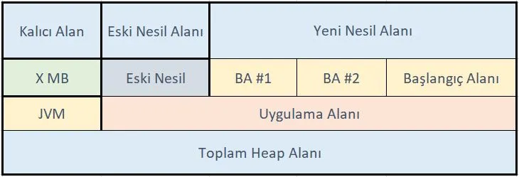

# homework-2

- `Java dünyasındaki framework’ler ve çözdükleri problemler nedir?(Spring MVC, JSP,
  Struct, Vaadin). Örnekler ile açıklayın. (20 Puan)`

- `Katmanlı mimari nedir? (10 Puan)`
  - Bir proje geliştirirken kodu farklı katmanlara bölmek ve her katmanı birbirinden bağımsız olarak
  yönetmek bakım için gereken çabayı azaltır.Ayrıca yazılımın mimarisi bir çok katmana bölündüğünde 
  gerekli değişiklikler çok daha kolay uygulanır.Her katmanın kendine özgü rolu ve sorumluluğu vardır.
  Ençok kullanılanı 3 katmalı mimaridir.
  - Ortak Katmanlar:
    - Sunum katmanı(Presentation)
    - Uygulama katmanı(Application/Server)
    - İş katmanı(Businiess/Domain)
    - Veri erişim katmanı(Data access/Persistence)

  - 3 Katmanlı Mimari
    - `Sunum Katmanı:`
      - Dış dünya ile bağlantıyı tesis eder. İstekleri aldığımız ve sonuçları gösterdiğimiz katmandır.
      - Sistemin yapması gereken işlevleri Uygulama katmanına iletir ve sonuçları yansıtır. 
    - `Uygulama Katmanı:`
      - Uygulamamızın sağlaması gereken tüm işlevleri geliştirdiğimiz yerdir.
      - Aynı zamanda doğrulamalarımızı yaparız. Örneğin, bir ürünü satın alırken stokta olup olmadığının kontrolünü yaparız.
      - Uygulama katmanı verileri kaydedilmek üzere veri katmanına veya kaydedilmiş verileri getirmek için veri katmanı ile iletişim kurar.
      - Ayrıca işlemlerin sonucunu sunum katmanına gönderir.
    - `Veri Katmanı:`
      - Veri tabanı ile iletişimimizi sağlar.
      - Verilerin uygulama Katmanına geri döndürür.
  - 

- `Garbage collector nedir, nasıl çalışır? Diğer C++ ile karşılaştırın. (10 Puan)`
  - Java'da bellek yönetimi garbage collector ile yapılır ve javanın en önemli özelliklerinden biridir.
  - Oluşturduğumuz nesnelere artık ihtiyaç kalmadığında Garbage collector bu nesneleri bulur ve belleği boşaltmak için onları siler.
  - Otomatik bir işlemdir ve JVM de sürekli olarak çalışır.
  - `Person onbject = new Person("Ufuk);` java nesne yi oluşturu ve ona bir referans atar
  -  `object =null;` atarsak işarekçi geçersiz olur. Bir nesnein yığın belleğinde referansı yok ise çöp toplamaya uygun
- 
  - Heap hafıza alanı içerisinde Jvm ve Gc nin ççalıştığı alanalr aşağıdaki gibidir.
  - 
  - 

  - `Spring frameworkünün kullandığı design patternlar neler? (10 Puan)`

- `Creational Patterns neler? Önceki ödevde oluşturulan nesnelerinizi factory Design
  patterni ile oluşacak şekilde düzenleyin. (25 Puan)`

- `Singleton ve AbstractFactory patterlerini implemente eden kodu yazın.(25 Puan)`
