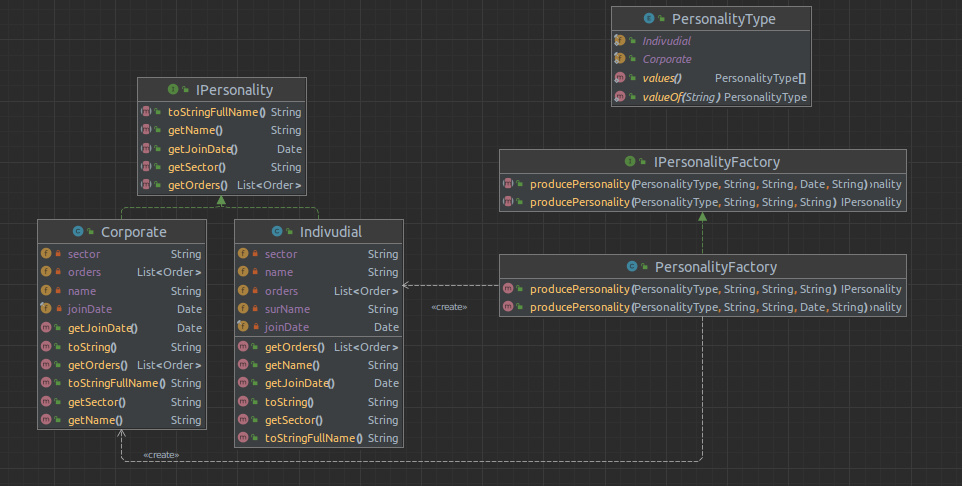
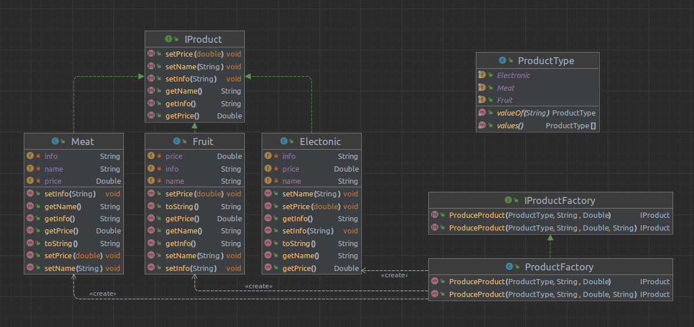
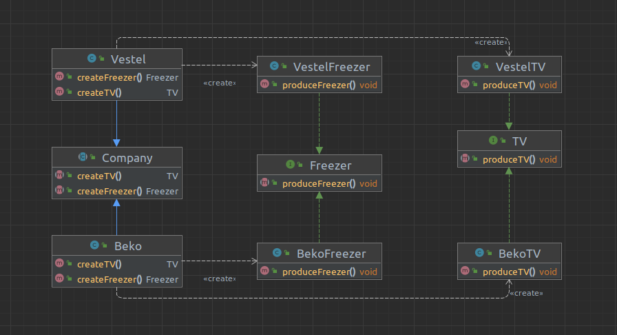
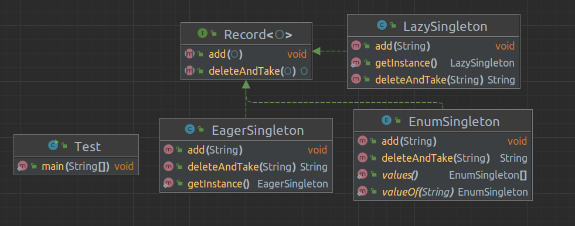

# homework-2

1. `Java dünyasındaki framework’ler ve çözdükleri problemler nedir?(Spring MVC, JSP,
   Struct, Vaadin). Örnekler ile açıklayın. (20 Puan)`

2. `Katmanlı mimari nedir? (10 Puan)`

- Bir proje geliştirirken kodu farklı katmanlara bölmek ve her katmanı birbirinden bağımsız olarak
  yönetmek bakım için gereken çabayı azaltır.Ayrıca yazılımın mimarisi bir çok katmana bölündüğünde
  gerekli değişiklikler çok daha kolay uygulanır.Her katmanın kendine özgü rolu ve sorumluluğu vardır.
  Ençok kullanılanı 3 katmalı mimaridir.
- Ortak Katmanlar:
    - Sunum katmanı(Presentation)
    - Uygulama katmanı(Application/Server)
    - İş katmanı(Businiess/Domain)
    - Veri erişim katmanı(Data access/Persistence)

- 3 Katmanlı Mimari
    - `Sunum Katmanı:`
        - Dış dünya ile bağlantıyı tesis eder. İstekleri aldığımız ve sonuçları gösterdiğimiz katmandır.
        - Sistemin yapması gereken işlevleri Uygulama katmanına iletir ve sonuçları yansıtır.
    - `Uygulama Katmanı:`
        - Uygulamamızın sağlaması gereken tüm işlevleri geliştirdiğimiz yerdir.
        - Aynı zamanda doğrulamalarımızı yaparız. Örneğin, bir ürünü satın alırken stokta olup olmadığının kontrolünü
          yaparız.
        - Uygulama katmanı verileri kaydedilmek üzere veri katmanına veya kaydedilmiş verileri getirmek için veri
          katmanı
          ile iletişim kurar.
        - Ayrıca işlemlerin sonucunu sunum katmanına gönderir.
    - `Veri Katmanı:`
        - Veri tabanı ile iletişimimizi sağlar.
        - Verilerin uygulama Katmanına geri döndürür.
- 

3. `Garbage collector nedir, nasıl çalışır? Diğer C++ ile karşılaştırın. (10 Puan)`

    - Java'da bellek temizleme işlemi garbage collector ile yapılır ve javanın en önemli özelliklerinden biridir.
    - Oluşturduğumuz nesnelere artık ihtiyaç kalmadığında Garbage collector bu nesneleri bulur ve belleği boşaltmak için
      onları siler.
    - Otomatik bir işlemdir ve JVM de sürekli olarak çalışır.
    - `Person onbject = new Person("Ufuk);` java nesne yi oluşturur ve ona bir referans atar
    - `object =null;` atarsak işaretçi geçersiz olur. Bir nesnenin bellekte referansı yok ise GC tarafından
      silinmeye uygun hale gelir.
    - Heap hafıza alanı içerisinde Jvm ve Gc nin çalıştığı alanalar aşağıdaki gibidir.
    - 
    - C++'da bu işlem programcı tarafından yapılmaktadır.Bu durum programcığya daha esnek bir kullanım sunarkenken
      sorumluluklarını arttırmaktadır.

4. `Spring frameworkünün kullandığı design patternlar neler? (10 Puan)`
    - `Proxy Pattern`
        - Proxy deseni, sık kullanılan nesnelerin Cache yapısına alınarak her kullanıldıklarında yeniden türetilmesini
          engellemek amacı ile kullanılmaktadır.
    - `Singleton Pattern:`
        - Singleton deseni, bir nesnenin bir defa oluşturularak her yerde kullanılmasını amaçlamaktadır. Böylece nesne
          birden fazla oluşturulmaz ve bellekte çok yer kaplayarak belleği gereksiz yere meşgul etmemektedir. Örneğin;
          bir projede veri tabanı bağlantı nesnesini bu yöntem ile yazabiliriz.
    - `Factory Method Pattern:`
        - Factory Method deseni, yazılım ortamında birden çok aynı özelliği gösterebilecek sınıflar için gerekli nesne
          üretiminin kalıtım yolu ile kalıtım yapılan nesne tarafından yapılmasını sağlamaktır.

    - `Decorator Pattern`
        - Bir nesneye runtime da yeni özellikler eklemek için kullanılır. Kalıtım kullanmadanda bir nesnenin görevlerini
          arttırmamızı sağlar.
    - `Strategy Pattern`
        - Strategy deseni bir algoritma ailesi oluşturup her birini farklı sınıfa yerleştirerek nesnelerini birbiri
          arasında değişebilir hale getirmeyi sağlayan bir tasarım desenidir.Bir işlemi yapabileceğimiz birden fazla
          algoritmaya sahipsek bu durumda ilgili strategy patten kullanılabilir.

5. `Creational Patterns neler? Önceki ödevde oluşturulan nesnelerinizi factory Design
   patterni ile oluşacak şekilde düzenleyin. (25 Puan)`
    - `Factory Method Pattern:`
        - Factory Method deseni, yazılım ortamında birden çok aynı özelliği gösterebilecek sınıflar için gerekli nesne
          üretiminin kalıtım yolu ile kalıtım yapılan nesne tarafından yapılmasını sağlamaktır.
    - `Abstract Factory Pattern:`
        - Abstract Factory deseni, aynı anda birden çok nesne ile birlikte işlem yapmak istediğimiz durumlarda
          kullanabileceğimiz bir tasarım desenidir.
    - `Builder Pattern:`
        - Builder deseni, bir nesneyi nesne tipi belirterek oluşturma işlemini yapan tasarım desenidir.
    - `Prototype Pattern:`
      - Sınıflardan nesneler yaratmak için constructorları kullanırız. Sınıfımızdaki field sayısı fazla olursa bu durumu çok karışık bir hale getirir. Her yeni field da yeni bir constructor eklememiz gerekir. Bu durumu aşmak için builder patterni kullanırız.
    - `Singleton Pattern:`
      - Singleton deseni, bir nesnenin bir defa oluşturularak her yerde kullanılmasını amaçlamaktadır. Böylece nesne birden fazla oluşturulmaz ve bellekte çok yer kaplayarak belleği gereksiz yere meşgul etmemektedir. Örneğin; bir projede veri tabanı bağlantı nesnesini bu yöntem ile yazabiliriz. 

    - "---------------------"
  
    - Product -> IProduct interface -> Fruit, Electronic,Meat.
    - Customer -> IPersonality inteface-> Indivudial ve Corporate.
    - 
    - 
    

6. `Singleton ve AbstractFactory patterlerini implemente eden kodu yazın.(25 Puan)`
    - AbstractFactory - Company
    - Factory - Vestel, Beko
    - Interface - TV, Freezer
    - Product - VestelTV, VestelFreezer, BekoTV, BekoFreezer
    - 
    
    - Singleton Eager lazy ve enum 
    - 

